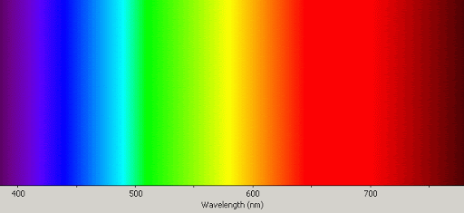
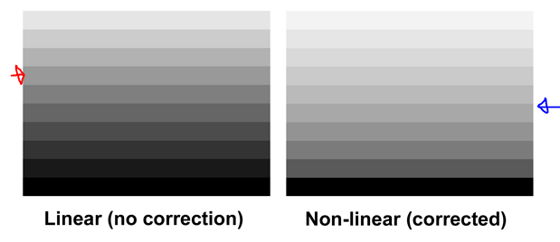
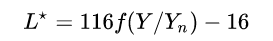
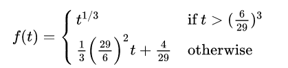
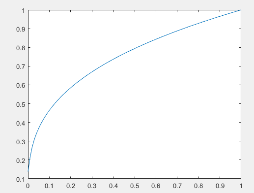

# HVS에 대한 정리

HVS(human vision system)에 대한 깊은 이해를 위한 정리 레포지토리 입니다. 

다음 사이트를 공부하고 정리하였습니다. 
link: http://poynton.ca/notes/colour_and_gamma/ColorFAQ.html

---

## 1. 색(color)이란 무엇인가?



인간은 400 nm ~ 700nm의 전자기파를 볼 수 있으며, 이 범위를 가시광선이라고 부른다. 이러한 가시 영역에서 망막에 들어오는 빛들의 지각 결과를 색이라고 한다. 무지개를 보자. 무지개를 보며 우리는 보통 '빨주노초파남보'로 색을 부른다. 실제로 무지개는 가시광선 영역 400 nm(보) ~ 700 nm(빨)의 연속적인 결과이다. 이렇게 특정 가시광선에 우리는 이름을 붙여 부른다.

인간의 눈에는 크게 두 종류의 광 수용체(photoreceptor)를 가지고 있는데, 간상세포(rod cell)와 원추세포(cone cell)가 그것이다. 간상세포는 주로 극도의 저조도 환경에서 동작한다. 이 간상세포는 주로 망막(fovea) 중심에서 떨어져 분포되어 있다. 만약, 성인 남성이라면 야간 사격 때를 기억해보자. 아무것도 안보이는 환경에서 곁눈질로 표적을 보면 더 잘보이는 것을 알 수 있다(이를 주변시라고 한다). 망막 외부에 rod cell이 많이 분포하여 있기 때문이다.

이제 원추세포를 보자. 원추세포는 세 가지 L(장 파장) 원추세포, M(중 파장) 원추세포, S(단 파장) 원추세포로 분리될 수 있는데, 이것이 우리에게 익숙한 RGB 색 표현의 선조님이다. 각 원추세포는 파장에 대한 민감도가 달라서, 각각 다른 색을 인지하는 역할을 한다. 우리는 이 세가지 원추세포에 반응한 빛의 양을 토대로 각기 다른 색을 인식한다.

자, 이제 해당 개념을 전자 장치(카메라, display 등)에 응용하기 위하여 컴퓨터가 알아먹을 수 있는 데이터로 바꿔보는 작업을 한다고 하자. 이러한 망막이 작동하는 방식을 수학적으로 모델링 한 시스템이 CIE system 이다. CIE 1931 XYZ 색 공간은 인간의 색채 인지를 수학적으로 모델링하였으며, 최초로 정의된 인간 시각 시스템 기반의 색 공간이다(주의: RGB보다 나중에 나왔다). 참고로 CIE system은 주로 자체발광체(self-luminous sources)에서 잘 동작한다. 즉, 디스플레이같은 분야에서는 적절하지만, 카메라 같이 반사된 빛을 다루는 분야(우리가 보는 모든 물체의 색은 빛이 반사된 결과이다)는 다른 시스템을 이용하는 것이 좋다.

이번 장을 정리하며 중요한 것은 우리가 보는 것은 결국 색이 아닌 파장/광선이라는 것이다. 색이라는 개념은 눈과 뇌에서 만들어지는 어떤 추상적인 개념이다.

## 2. 강도(Intensity)란 무엇인가?

강도(Intensity)는 쉽게 말해서 빛의 양이다. 보다 구체적으로 intensity는 어떤 전자기파의 스펙트럼에서 일정 간격에 대한 측정 값이다. 예를들어 광도(luminous intensity)는 광원의 밝기 값(광원의 빛의 양)이다. 여담으로 카메라는 실제 Intensity를 기반으로 영상을 얻는다. 즉 빛의 세기만을 모으는 것이다. 그러나 각각 color filter array(e.g, bayer pattern)를 거쳐 의미있는 색만을 통과 시켜 빛의 세기를 저장한다. 즉, 근본적으로 색(파장) 자체를 센싱하는 센서는 존재하지 않고, 이렇게 특정 빛만을 통과시키는 필터를 이용하여 색 값을 센싱한다 (내 지식 선에선).

## 3. 휘도(Luminance)란 무엇인가?


명도(birghtness)라는 개념은 굉장히 복합적이다. 따라서, the CIE는 휘도(luminance)라는 단위를 정의하여 스펙트럼에 따른 민감도 단위를 분리하였다. 가장 쉽게 표현한 휘도는 화면이 얼마나 밝은지이다. 더 정확하게는 특정 방향에 대한 광 입자의 밀도이다. 

일반적으로 물체는 빛을 만들지 않는다. 광원에서 발사된 빛은 물체에 닿아 특정 파장은 흡수되고, 나머지 파장은 반사된다. 우리는 이 흡수되지 않은 빛을 보고 있을 뿐이다. 이 반사된 빛의 밝기가 휘도이다. 

단위 휘도(maginitude of luminance)와 강도(intensity)는 동일하게 물리적 힘에 비례한다. 그러나, 휘도는 인간 시각 시스템에서의 파장에 대한 민감도를 나타낸다는 점에서 다르다.

Lab color space에서 L은 휘도이다. 주로 1~100의 값으로 양자화하여 표현한다(실제로는 단위 면적당 칸델라(candelas)의 양으로 나타내야 한다). 

그렇다면, 명도와 휘도의 차이는 무엇일까? 휘도는 정량적 단위이다. 즉 모든 모니터는 단위 면적당 칸델라를 조정하므로써 같은 휘도를 가질 수 있다. 그러나, 명도는 주관적 밝기 단위이다. 따라서, 정량적 수치로 표현할 수 없다!

## 4. 명도(brightness)란 무엇인가?

빛이 투사될 때 광량에 따라 눈에 느껴지는 주관적 빛의 양을 명도라고 한다. 재밌는 것은 명도라는 개념은 상한선이 없다. 빛의 양 자체가 무한히 정의될 수 있기 때문에, 어떤 광원은 이론상 무한대로 밝을 수 있다. 그래서 우리는 주로 상대적으로 밝기를 평가한다(이것 보단 밝다, 어둡다..). 그러나, 주의해야 할 것이, 물체를 보고 느끼는 표면의 명도는 밝기(lightness)라는 표현을 사용한다

## 5. 밝기(lightness)란 무엇인가?



인간의 시각 시스템은 어떤 명도를 비선형으로 느낀다. 위의 왼쪽 그림은 명도를 일정 상수로(linear하게) 떨어뜨려 표현하는 것이고, 오른쪽 그림은 밝기를 non-linear하게 떨어뜨려 표현한 것이다. 그러나, 우리 눈은 왼쪽 이미지는 non-linear하게 감소한다고 느끼며, 오른쪽 이미지가 linear하게 밝기 값이 감소한다고 느낀다. 우리는 linear하게 표현한 이미지에서 빨간색 화살표가 밝기의 중간점이라고 느낀다. 오른쪽 이미지에서는 파란색이 밝기의 중간점이라고 느낀다. 실제로는 그렇지 않은데도 말이다. 보는 것 처럼, 우리의 눈은 비선형적으로 작동한다.

이렇듯 어떤 휘도에 대한 인지적(perceptual) 반응도를 밝기(lightness)라고 부른다. 이것은 the CIE에서 모델링 된 개념이며 다음과 같은 수식으로 표현된다.




여기서 Y_n은 보통 하얀색으로 정의 내린 휘도이다. 해당 모델링을 간단하게 분석해보면, 결국 휘도를 하얀색에 해당하는 휘도로 정규화하고, 함수 f(t)를 적용하는 것인데, 함수 f(t)는 다음과 같이 정의된다.



이를 다음과 같은 매트랩 수식으로 출력해보자.

```matlab
x = 0:0.01:1;
fn = @(t) (t > (6/29).^3) .* t.^(1/3) + (t <= (6/29).^3) .* ((1/3) .* (6/29).^2 .* t + (4/29));
y = fn(x);
plot(x,y);
```



여기서 알 수 있는 것은, 해당 명도에 대한 모델링이 log 모양과 비슷하다는 것이다. 즉 로가리듬 함수이다. 쉽게 생각해서, 밝기 값이 적을 때에는 lightness 결과 편차가 크다. 그러나, 밝기 값이 클 때에는 lighteness 결과 편차가 크지 않다(로그!!). 즉, "인간의 시각은 어떤 휘도에 대해서 어두울 때 그 민감도 차이가 크다"를 모델링 한 수식이다. linear와 non-linear 그림에서 왼쪽 사진이 좀 더 어둡게 느껴졌던 것은 인간이 '어둡다'라는 것에 더 민감하게 반응하기 때문이다!

우리가 알고 있는 Lab color space는 휘도(luminance)가 아닌 밝기(lightness)라는 점에 주의하자! 

## 6. 색의 속성 정리

여기까지 정리하니, 색의 속성이 헷갈릴 수 있다. brightness나 lightness는 모두 명도 또는 밝기로 번역 될 수 있다.  또한, value, luminosity, luma 등도 모두 명도로 번역 될 수 있다. 구분해서 표현해보자.

- Brightness (명도)
  - 주관적 밝음의 정도
- Lightness (명도)
  - 인간의 인지(perception) 시스템이 반영된 주관적 밝음의 정도
  - 상대적 휘도가 적용 되었다.
- luminance (휘도)
  - 관찰자의 들어오는 빛, 단위 면적당 광도의 양
- luminosity (광도)
  - 물체에서 발산되는 빛 에너지의 양

---


작성중.. 

http://poynton.ca/notes/colour_and_gamma/ColorFAQ.html#RTFToC3

**Reference**

1. http://poynton.ca/notes/colour_and_gamma/ColorFAQ.html#RTFToC3
2. https://blog.lgdisplay.com/2015/04/luminance/
3. https://ko.wikipedia.org/wiki/%EC%83%89_%EA%B3%B5%EA%B0%84
4. 